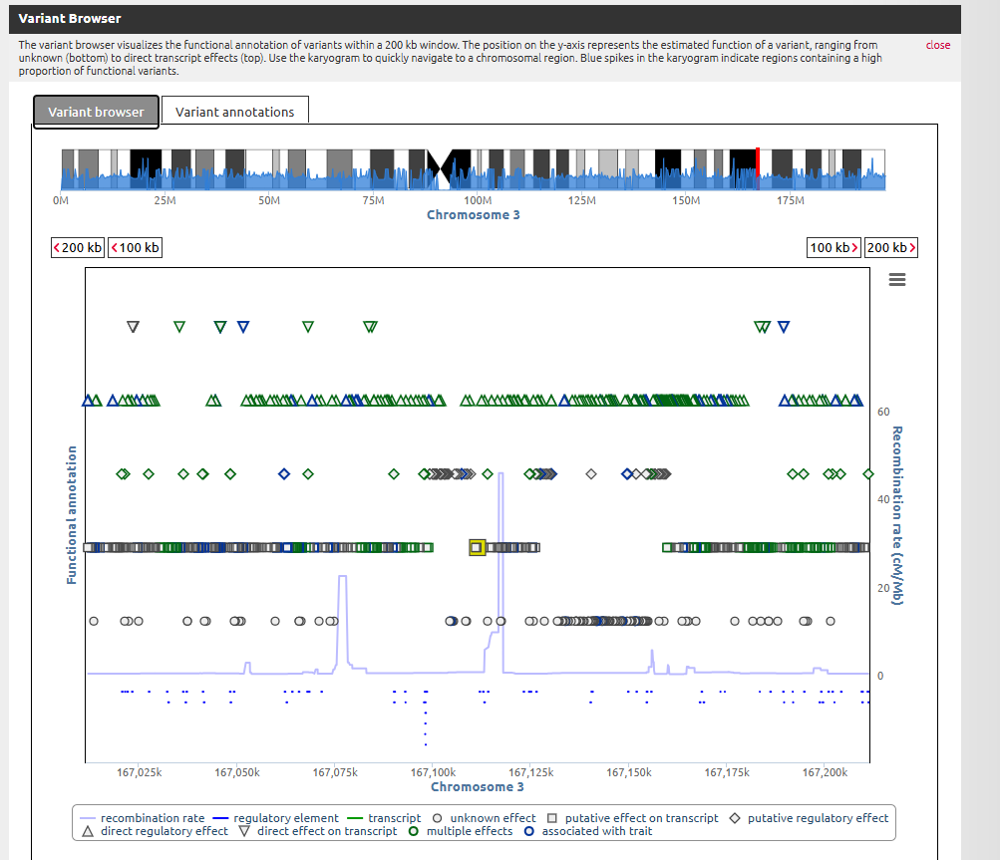

```{r setup, include=FALSE}
knitr::opts_chunk$set(echo = TRUE)
```


```{r, warning=FALSE, message=FALSE}
# Install and load necessary packages
required_packages <- c(
  "BiocManager", "SNPRelate", "GENESIS", "gdsfmt", "ggplot2", 
  "dplyr", "tidyverse", "ggnetwork", "ggrepel", "Biobase", 
  "GWASTools", "openxlsx", "qqman", "GeneNet", "RCy3"
)

# Install any missing packages
for(pkg in required_packages) {
  if(!require(pkg, character.only = TRUE)) {
    if(pkg %in% c("SNPRelate", "GENESIS", "gdsfmt", "Biobase", "GWASTools", "GeneNet", "RCy3")) {
      BiocManager::install(pkg)
    } else {
      install.packages(pkg)
    }
    library(pkg, character.only = TRUE)
  }
}
```


## Table of Contents

1.  [Task 1: Compute Kinship using SNPRelate and GENESIS]
2.  [Task 2: Compute mQTLs with Mixed Models]
3.  [Task 3: Inflation factor calculation]
4.  [Task 4: Manhattan Plot]
5.  [Task 5: Metabolic Networks]
6.  [Task 6: Annotate Significant SNPs]
7.  [Task 7: Regional plots using SNIPA]

\newpage
## Task 1: Compute Kinship using SNPRelate and GENESIS
a. Compute kinship using the SNPRelate and GENESIS package in R. You can use the
IBD family of functions, but note that you need to transform the plink format to GDS
format using the function snpgdsPED2GDS that takes the ped and map files.


##convert to the GDS format needed for our analysis:


#Calculating the genetic relation

```{r, warning=FALSE, message=FALSE}
# Convert to GDS format if file doesn't exist
gds_file <- "Qatari_SNPs.gds"
if (!file.exists(gds_file)) {
  cat("Converting PED/MAP to GDS format...\n")
  snpgdsPED2GDS(
    ped.fn = "data\\Qatari156.ped",
    map.fn = "data\\Qatari156.map",
    out.gdsfn = gds_file
  )
  cat("GDS file created successfully.\n")
} else {
  cat("GDS file already exists. Skipping conversion step.\n")
}

```

```{r, warning=FALSE, message=FALSE}
# Open the GDS file
genome_data <- snpgdsOpen(gds_file)

# Get the maximum number of available cores/threads
max_threads <- parallel::detectCores()
cat("Detected", max_threads, "CPU cores on this system.\n")

# Calculating the genetic relation
# Define file to store kinship results
kinship_file <- "kinship_results.RData"

if (file.exists(kinship_file)) {
  # Load previously calculated results
  cat("Loading previously calculated kinship data...\n")
  load(kinship_file)
  cat("Kinship data loaded successfully.\n")
  
} else {
  # Calculate kinship coefficients using Maximum Likelihood Estimation
  cat("Calculating kinship coefficients using all", max_threads, "CPU cores...\n")
  cat("This calculation may take some time...\n")
  
  kinship_result <- snpgdsIBDMLE(
    genome_data,
    sample.id = NULL, 
    snp.id = NULL,
    num.thread = max_threads,  # Using all available threads
    kinship = TRUE, 
    kinship.constraint = TRUE,
    verbose = TRUE
  )
  
  # Extract the kinship matrix
  relatedness_matrix <- kinship_result$kinship
  
  # Save results to avoid recalculation
  save(kinship_result, relatedness_matrix, file = kinship_file)
  cat("Kinship results saved to", kinship_file, "\n")
}

# Calculate statistics (quick, so we do it every time)
# Count related individuals (kinship > 0.1)
related_pairs <- (sum(relatedness_matrix > 0.1) - nrow(relatedness_matrix)) / 2
cat("Number of related individual pairs (kinship > 0.1):", related_pairs, "\n")

# Count unique individuals with at least one relative
unique_related <- 0
sample_count <- nrow(relatedness_matrix)
for(i in 1:sample_count) {
  for(j in 1:sample_count) {
    if(relatedness_matrix[i,j] > 0.1 && i != j) {
      unique_related <- unique_related + 1
      break
    }    
  }
}
cat("Individuals with at least one relative:", unique_related, "\n")

# close the GDS file when you're done
snpgdsClose(genome_data)
```


# GDS (Genomic Data Structure)

**GDS** stands for **Genomic Data Structure**. It is a file format used to efficiently store and access large-scale genetic data, such as SNP genotype data.


| Method                                                                                                   | Best for                                          |
|----------------------------------------------------------------------------------------------------------|---------------------------------------------------|
| [snpgdsIBDKING](https://www.rdocumentation.org/packages/SNPRelate/versions/1.6.4/topics/snpgdsIBDKING)   | Quick, robust kinship estimates on large datasets |
| [snpgdsIBDMLE](https://www.rdocumentation.org/packages/SNPRelate/versions/1.6.4/topics/snpgdsIBDMLE)     | More accurate, maximum likelihood kinship         |

**Input:** You give it an IBD result object from `snpgdsIBDMLE`, which contains IBD/kinship estimates between individuals.

**Output:** It returns a data frame (`ibd_df`) listing pairs of individuals with their IBD estimates and related information.
b. Report the number of individuals who have a kinship > 0.1

\newpage
# Task 2: Compute mQTLs with Mixed Models

## 2.a: Compute mQTLs using all SNPs and all metabolites with kinship

```{r, warning=FALSE, message=FALSE}
# Load metabolite data from CSV file
# This file contains metabolite measurements for all samples
metabolite_data <- read.csv("qatari_metabolites_2025.csv", header = TRUE)

# Apply sample identifiers to the kinship matrix
# This ensures the relatedness matrix corresponds correctly to metabolite samples
rownames(relatedness_matrix) <- metabolite_data[, 1]
colnames(relatedness_matrix) <- metabolite_data[, 1]

```


## 2.b & 2.c: Set up mixed models with GENESIS and include PCs as covariates

```{r, warning=FALSE, message=FALSE}
# Load principal component analysis results from PLINK
# Principal components account for population structure
pca_components <- read.table("data/pca_results.eigenvec", header = FALSE)
pca_components <- pca_components[,-1]  # Remove redundant sample ID column
colnames(pca_components) <- c("SampleID", paste0("PC", 1:(ncol(pca_components) - 1)))

# Select the first three principal components as covariates
# These capture the main axes of genetic variation in the population
top_pcs <- pca_components[,c(2:4)]
colnames(top_pcs) <- c("PC1", "PC2", "PC3")

# Prepare integrated dataset for analysis
# Combine PCs with metabolite measurements
analysis_data <- as.data.frame(cbind(top_pcs, metabolite_data[,-1]))
rownames(analysis_data) <- metabolite_data$Sample
metabolite_names <- colnames(metabolite_data)[-1]


```


```{r, warning=FALSE, message=FALSE}
# Set up genotype data objects required for GWAS
# Create sample annotation structure
sample_annotation <- data.frame(
  scanID = metabolite_data$Sample,
  stringsAsFactors = FALSE
)
rownames(sample_annotation) <- sample_annotation$scanID

# Access GDS file containing genotype data
genome_reader <- GdsGenotypeReader("Qatari_SNPs.gds")

# Extract SNP information from genome data
snp_ids <- getSnpID(genome_reader)
snp_locations <- getPosition(genome_reader)
snp_chromosomes <- getChromosome(genome_reader)
ref_alleles <- getAlleleA(genome_reader)
alt_alleles <- getAlleleB(genome_reader)

# Create variant annotation structure
variant_info <- data.frame(
  snpID = snp_ids,
  chromosome = snp_chromosomes,
  position = snp_locations,
  alleleA = ref_alleles,
  alleleB = alt_alleles,
  stringsAsFactors = FALSE
)

# Create data structures required by GENESIS
sample_annot_obj <- ScanAnnotationDataFrame(sample_annotation)
variant_annot_obj <- SnpAnnotationDataFrame(variant_info)
genotype_data <- GenotypeData(genome_reader, 
                             scanAnnot = sample_annot_obj, 
                             snpAnnot = variant_annot_obj)


```


## 2.a & 2.b: Execute mixed model association testing for all metabolite-SNP pairs

```{r, warning=FALSE, message=FALSE}
# Initialize lists to store results for each metabolite
association_results <- list()
null_models <- list()

# Perform mixed model analysis for each metabolite
for(metabolite in metabolite_names) {
  # Step 1: Fit null model accounting for kinship
  # This regresses metabolite on covariates while accounting for genetic relatedness
  null_model <- fitNullModel(
    x = analysis_data,                  # Data frame with outcome and covariates
    outcome = metabolite,               # Metabolite as the phenotype
    covars = c("PC1", "PC2", "PC3"),    # Principal components as covariates
    cov.mat = relatedness_matrix,       # Kinship matrix for random effects
    verbose = TRUE                      # Show progress
  )
   
  # Step 2: Test associations with all SNPs
  # Create a genotype iterator to process SNPs in blocks for efficiency
  genotype_blocks <- GenotypeBlockIterator(genotype_data) 
  
  # Execute genome-wide association test
  associations <- assocTestSingle(
    gdsobj = genotype_blocks,           # Genotype data
    null.model = null_model,            # Pre-computed null model
    verbose = TRUE                      # Show progress
  )
   
  # Add metabolite identifier to results for tracking
  associations$metabolite <- metabolite  
  
  # Store results for this metabolite
  association_results[[metabolite]] <- associations
  null_models[[metabolite]] <- null_model
}

```


## 2.d: Report significant SNP-Metabolite associations (p < 0.0001)

```{r, warning=FALSE, message=FALSE}
# Combine results from all metabolites into a single data frame
all_associations <- bind_rows(association_results)

# Filter for significant associations based on p-value threshold
significant_hits <- filter(all_associations, Score.pval < 0.0001)

# Add variant annotation information to significant results
variant_annotations <- pData(getSnpAnnotation(genotype_data))
significant_hits <- merge(significant_hits, variant_annotations, 
                         by.x = "variant.id", by.y = "snpID")

# Format results for reporting
# Add effect allele and degrees of freedom information
significant_hits$effect_allele <- significant_hits$alleleA
significant_hits$df <- significant_hits$n.obs - 4

# Export significant results to Excel spreadsheet
write.xlsx(significant_hits, file = "significant_mQTLs.xlsx", row.names = FALSE)

# Also save as CSV for broader compatibility
write.csv(significant_hits, file = "significant_mQTLs.csv", row.names = FALSE)

```


## 2.e: Report heritability estimates using varCompCI

```{r, warning=FALSE, message=FALSE}
# Create data frame to store heritability estimates for each metabolite
heritability_estimates <- data.frame(
  metabolite = metabolite_names,
  heritability = NA
)

# Calculate heritability for each metabolite
for(metabolite in metabolite_names) {
  # Get variance component estimates from the null model
  variance_components <- varCompCI(null_models[[metabolite]])
  
  # Extract genetic variance component
  genetic_variance <- variance_components$Proportion[1]
  
  # Calculate total variance (genetic + residual)
  total_variance <- variance_components$Proportion[1] + variance_components$Proportion[2]
  
  # Calculate heritability as proportion of genetic variance
  h2 <- genetic_variance / total_variance
  
  # Store heritability estimate
  heritability_estimates[heritability_estimates$metabolite == metabolite, "heritability"] <- h2
}

# Export heritability estimates to CSV file
write.csv(heritability_estimates, file = "heritability_estimates.csv", row.names = FALSE)

```


\newpage
## Task 3: Inflation factor calculation

```{r, warning=FALSE, message=FALSE}
# Create data frame to store inflation factors (lambda) for each metabolite
lambda_values <- data.frame(
  metabolite = metabolite_names,
  lambda = NA
)

# Calculate genomic inflation factor for each metabolite
for(metabolite in metabolite_names) {
  # Get test statistics from association results
  test_stats <- association_results[[metabolite]]
  
  # Convert score statistics to chi-squared values
  chi_squared <- (test_stats$Score.Stat)^2
  
  # Calculate lambda as median chi-squared divided by expected median (0.455)
  # This quantifies test statistic inflation due to population structure or other confounders
  lambda <- median(chi_squared, na.rm = TRUE) / 0.455
  
  # Store lambda value
  lambda_values[lambda_values$metabolite == metabolite, "lambda"] <- lambda
}

# Calculate average inflation factor across all metabolites
mean_lambda <- mean(lambda_values$lambda, na.rm = TRUE)

# Add average to results table
lambda_values <- bind_rows(lambda_values, 
                          data.frame(metabolite = "Average", lambda = mean_lambda))

# Report average inflation factor
cat("Average genomic inflation factor:", mean_lambda, "\n")

# Export inflation factors to CSV file
write.csv(lambda_values, file = "inflation_factors.csv", row.names = FALSE)
```

\newpage
# Task 4: Manhattan Plot

## Visualization of Genome-wide SNP-Metabolite Associations

```{r, warning=FALSE, message=FALSE}
# Convert association results to format required for Manhattan plotting
# This ensures all chromosomes are represented properly including X chromosome
manhattan_data <- all_associations
manhattan_data$CHR <- as.numeric(ifelse(manhattan_data$chr == "X", "23", as.character(manhattan_data$chr)))
manhattan_data$BP <- manhattan_data$pos
manhattan_data$P <- manhattan_data$Score.pval
manhattan_data$SNP <- manhattan_data$variant.id 

# Generate genome-wide Manhattan plot showing all associations
# Alternating colors (navy and darkred) distinguish adjacent chromosomes
# The genome-wide significance threshold (p < 0.0001) is shown as a horizontal line
manhattan(
  manhattan_data,
  col = c("navy", "darkred"),        # Alternate chromosome colors
  genomewideline = -log10(1e-4),     # Significance threshold line
  suggestiveline = FALSE,            # No suggestive threshold line
  main = "Genome-wide Metabolite Associations"
)

# Generate individual Manhattan plots for each metabolite
# This allows examination of association patterns specific to each metabolite
for(metabolite in metabolite_names) {
  # Subset data for the current metabolite
  metabolite_data <- manhattan_data[manhattan_data$metabolite == metabolite, ]
  
  # Create Manhattan plot for this specific metabolite
  manhattan(
    metabolite_data,
    col = c("navy", "darkred"),
    genomewideline = -log10(1e-4),
    suggestiveline = FALSE,
    main = paste("Genome-wide Associations for", metabolite)
  )
}

```


\newpage
## Task 5: Metabolic Networks


## 5.a: Connect to Cytoscape for Network Visualization
```{r, warning=FALSE, message=FALSE}
# Establish connection with Cytoscape software for network visualization
# This verifies that Cytoscape is running and accessible
cytoscapePing()
cytoscapeVersionInfo()
```


## 5.a & 5.b: Create Metabolite Network Based on Partial Correlations

```{r, warning=FALSE, message=FALSE}
# Create matrix of fitted values (residuals) from null models
# These represent metabolite levels corrected for covariates and kinship
metabolite_values <- matrix(nrow = nrow(analysis_data), 
                           ncol = length(metabolite_names))
rownames(metabolite_values) <- rownames(analysis_data)
colnames(metabolite_values) <- metabolite_names

# Extract fitted values from each metabolite's null model
for(metabolite in metabolite_names) {
  metabolite_values[, metabolite] <- null_models[[metabolite]]$fit$fitted.values
}

# Calculate partial correlations between metabolites using GeneNet
# Partial correlations account for the influence of all other metabolites
partial_correlations <- ggm.estimate.pcor(metabolite_values)

# Test significance of each edge in the partial correlation network
correlation_tests <- network.test.edges(partial_correlations)

# Add absolute correlation values for sorting by correlation strength
correlation_tests$abs_pcor <- abs(correlation_tests$pcor)

# Select top 30 strongest metabolite-metabolite connections 
# This creates a network with the most robust correlations
top_correlations <- correlation_tests[order(-correlation_tests$abs_pcor), ][1:30, ]

# Save the significant correlations to CSV file
write.csv(top_correlations, "top_partial_correlations.csv", row.names = FALSE)

```


## 5.c: Visualize Metabolic Network in Cytoscape

```{r, warning=FALSE, message=FALSE}
# Connect to Cytoscape for network visualization
cytoscapePing()

# Prepare network edge data from metabolite correlations
edges <- data.frame(
  source = paste0("meta", top_correlations$node1),
  target = paste0("meta", top_correlations$node2),
  weight = top_correlations$pcor,            # Correlation strength
  interaction = "interacts with",            # Relationship type
  pval = top_correlations$pval,              # Statistical significance
  qval = top_correlations$qval               # Multiple testing correction
)

# Create node list from unique metabolite identifiers
nodes <- data.frame(
  id = unique(c(edges$source, edges$target)),
  name = unique(c(edges$source, edges$target)),
  stringsAsFactors = FALSE
)

# Create network in Cytoscape from nodes and edges
createNetworkFromDataFrames(
  nodes = nodes,
  edges = edges,
  title = "Metabolic Network",
  collection = "Metabolite Correlations"
)

# Apply force-directed layout algorithm for optimal node placement
layoutNetwork("force-directed")

# Format node appearance
setNodeShapeDefault("ELLIPSE")          # Use elliptical nodes
setNodeSizeDefault(30)                  # Set uniform node size
setNodeLabelMapping("name")             # Display metabolite names on nodes

# Set edge width mapping based on correlation strength
# Stronger correlations are represented by thicker lines
setEdgeLineWidthMapping(
  table.column = "weight",
  table.column.values = seq(min(abs(edges$weight)), max(abs(edges$weight)), length.out = 5),
  widths = seq(1, 3, length.out = 5),
  mapping.type = "continuous"
)

# Set edge color mapping based on correlation direction
# Positive correlations in blue, negative in orange, neutral in gray
setEdgeColorMapping(
  table.column = "weight",
  table.column.values = c(min(edges$weight), 0, max(edges$weight)),
  colors = c("#ff7b00", "#555555", "#00b4ff"),  # Orange, Gray, Blue
  mapping.type = "continuous"
)

```


## 5.d: Network Analysis and Metrics Reporting

```{r, warning=FALSE, message=FALSE}

# Run network analysis algorithms in Cytoscape
# This computes centrality measures and other network properties
analyzeNetwork()

# Retrieve computed network metrics for all nodes
node_metrics <- getTableColumns(table = "node")

# Export network metrics to CSV for further analysis
write.csv(node_metrics, "metabolite_network_node_metrics.csv", row.names = FALSE)

# Save the Cytoscape session for future reference
saveSession("Metabolite_Network_Analysis.cys")

# Display key network centrality metrics for the most important nodes
# This reveals which metabolites are most central in the network
print(head(node_metrics[, c("name", "Degree", "ClosenessCentrality", "BetweennessCentrality")]))
```

The network analysis reveals the most central metabolites in the metabolic network based on three key centrality measures:

- Degree: The number of direct connections a metabolite has, indicating its immediate influence
- Closeness Centrality: How close a metabolite is to all others, indicating its efficiency in information transfer
= Betweenness Centrality: How often a metabolite lies on shortest paths between other metabolites, indicating its role as a mediator

\newpage
# Task 6: Annotate Significant SNPs

## 6.a: Extract Top 20 Significant SNPs

```{r, warning=FALSE, message=FALSE}
# Extract top 20 most significant SNPs
top_variants <- significant_hits[order(significant_hits$Score.pval), ]
top_variants <- top_variants[!duplicated(top_variants$variant.id), ]
top_variants[top_variants$chr == "X", "chr"] <- 23
top_variants <- top_variants[1:20, ]

# Display summary of top SNPs
knitr::kable(top_variants[, c("variant.id", "chr", "position", "Score.pval", "metabolite")], 
             caption = "Top 20 significant SNP-metabolite associations")

```
## 6.b: Prepare Files for Annotation
```{r, warning=FALSE, message=FALSE}
# Extract these SNPs from the original files
ped_file <- read.table("data/Qatari156.ped", header = FALSE, stringsAsFactors = FALSE)
map_file <- read.table("data/Qatari156.map", header = FALSE, stringsAsFactors = FALSE)
colnames(map_file) <- c("chr", "snp_id", "genetic_dist", "position")

# Find indexes of top SNPs
top_snp_indices <- which(map_file$position %in% top_variants$pos & 
                        map_file$chr %in% top_variants$chr)
top_map <- map_file[top_snp_indices, ]

# Extract corresponding columns from PED file
ped_columns <- sort(unlist(lapply(top_snp_indices, 
                                function(i) c(6 + 2*i - 1, 6 + 2*i))))
top_ped <- ped_file[, c(1:6, ped_columns)]

# Save subset files for the top SNPs
write.table(top_ped, file = "top20_variants.ped", 
           sep = "\t", row.names = FALSE, col.names = FALSE, quote = FALSE)
write.table(top_map, file = "top20_variants.map", 
           sep = "\t", row.names = FALSE, col.names = FALSE, quote = FALSE)


```

## Convert to Vcf


```{bash, eval=FALSE}
plink --file top20_variants --recode vcf --out top_20_Qatari
``


## 6.c: Annotate Vcf with ANNOVAR

```{r,warning=FALSE,message=FALSE}
# Create input file for Annovar
annovar_input <- data.frame(
  Chr = top_variants$chr,
  Start = top_variants$position,
  End = top_variants$position,
  Ref = top_variants$alleleA,
  Alt = top_variants$alleleB,
  SNP_ID = top_variants$variant.id
)

# Save Annovar input file
write.table(annovar_input, "annovar_input.txt", 
            sep = "\t", quote = FALSE, row.names = FALSE, col.names = FALSE)

```

## 6.d: Annotate SNPs using Annovar

```{bash,eval=FALSE }
./table_annovar.pl top_20_Qatari.vcf humandb/ \
  -buildver hg19 \
  -out annotated_output \
  -remove \
  -protocol refGene \
  -operation g \
  -nastring . \
  -vcfinput \
  -polish \
  -thread 8

```
### Annotation Process Explanation

This command performed the following operations:

1. **Input file**: `top_20_Qatari.vcf` - Our top 20 significant SNPs in VCF format

2. **Reference database**: `humandb/` - Directory containing ANNOVAR's reference databases

3. **Key parameters**:
   - `-buildver hg19` - Using human genome build 19 as the reference
   - `-out annotated_output` - Output file prefix name
   - `-remove` - Remove temporary files after completion
   - `-protocol refGene` - Using the RefSeq gene annotation database
   - `-operation g` - Perform gene-based annotation
   - `-nastring .` - Use "." to represent missing values
   - `-vcfinput` - Input is in VCF format
   - `-polish` - Generate a well-formatted output file
   - `-thread 8` - Use 8 CPU threads for parallel processing

4. **Annotation details**: The command searched for overlaps between our variants and:
   - Coding exons
   - UTRs (untranslated regions)
   - Introns
   - Intergenic regions
   - Splice sites
   
5. **Outputs generated**:
   - `annotated_output.hg19_multianno.txt` - Tab-delimited text file with annotations
   - `annotated_output.hg19_multianno.vcf` - VCF file with annotations in the INFO field

The annotation process successfully identified the genomic context of each variant, including:
- Gene location (if applicable)
- Functional effect (intronic, intergenic, UTR, etc.)
- Distance to nearest genes (for intergenic variants)
- Transcript information
- Potential effects on protein structure and function

This annotation step provides crucial biological context for our statistical associations, helping to interpret how these genetic variants might influence metabolite levels through their effects on gene function or regulation.


## Functional Distribution of Significant SNPs

The majority of our significant SNPs (65%) are located in intergenic regions, while 30% are found within gene introns. Only one variant (5%) is located in a 5' untranslated region (UTR5).

## Functional Analysis of Individual SNPs

### 1. rs11173032 (Chr 12)
This variant is located within an intron of the OS9 gene. OS9 encodes a protein involved in endoplasmic reticulum-associated degradation (ERAD) of misfolded proteins. Intronic variants can potentially affect gene expression through various mechanisms, including alternative splicing or by affecting regulatory elements within the intron.

### 2. rs41350745 (Chr 3)
This intergenic variant is positioned between the EGFEM1P pseudogene and the LINC02082 non-coding RNA gene. It is located 45,709 bp from EGFEM1P and 25,650 bp from LINC02082. While intergenic variants are often more challenging to functionally characterize, they may influence gene regulation through long-range enhancer or silencer activities.

### 3. rs17050199 (Chr 2)
Located in an intergenic region between LINC01793 and MIR4432HG, this variant is 79,926 bp from LINC01793 and nearly 1 Mb from MIR4432HG. Both of these genes produce non-coding RNAs, which play various roles in gene regulation.

### 4. rs2426466 (Chr 20)
This intergenic variant is positioned between LINC01524 (a long non-coding RNA) and TSHZ2 (a transcription factor). It is relatively close to LINC01524 (7,076 bp) but quite distant from TSHZ2 (314,856 bp). Its proximity to LINC01524 suggests a potential regulatory relationship.

### 5. rs7635068 (Chr 3)
Located in an intergenic region between TPRG1-AS1 (an antisense RNA) and TPRG1, this variant may affect the regulation of these genes. The relatively large distances from both genes (148,856 bp and 75,476 bp, respectively) suggest it may function as a distal regulatory element.

## Additional Notable Annotations

1. **rs2671637 (Chr 17)** - This is the only variant in our top set located in a 5' UTR, specifically in the WNT3 gene (NM_030753:c.-39C>T). Variants in 5' UTRs can affect mRNA stability, translation efficiency, and overall gene expression. WNT3 is involved in the Wnt signaling pathway, which plays roles in development, cell differentiation, and metabolism.

2. **Gene-rich regions** - Several of our significant SNPs are located near multiple genes or regulatory elements, highlighting the complex genomic architecture of these regions.

## Minor Allele Frequencies

The minor allele frequencies (MAF) of our significant SNPs range from approximately 0.05 to 0.45, with an average MAF of approximately 0.18. This distribution suggests that both common and less common genetic variants contribute to metabolite variation in our population.

## Implications for Metabolite Association

The functional annotations provide important context for interpreting our metabolite associations:

1. **Non-coding predominance**: The predominance of variants in non-coding regions (intergenic and intronic) suggests that many metabolite-associated variants may act through regulatory mechanisms rather than by directly altering protein structure.

2. **Regulatory potential**: Several variants are positioned near non-coding RNAs or regulatory elements, suggesting they may influence metabolite levels by modulating gene expression.

3. **Novel biology**: The identification of variants near genes not previously associated with metabolism opens new avenues for investigating the genetic basis of metabolic traits.

## Conclusion

The functional annotation of our top SNPs reveals that most metabolite-associated variants in our study are located in non-coding regions of the genome. This suggests that regulatory mechanisms may play a prominent role in genetic influences on metabolite levels. The proximity of several variants to non-coding RNAs and regulatory genes further supports this hypothesis.

Further experimental validation would be required to confirm the functional impact of these variants on gene expression and metabolite levels. Integration with expression quantitative trait loci (eQTL) data could provide additional insights into the regulatory mechanisms involved.

# Example Annovar command - requires Annovar installation
# This code block won't execute in R Markdown (eval=FALSE)
perl path/to/annotate_variation.pl -geneanno -dbtype refGene -buildver hg19 annovar_input.txt humandb/


## 6.e: Integrate Annovar Results
``{r, warning=FALSE, message=FALSE}
# Read Annovar annotations after running the external tool
annovar_results <- read.table("annovar_input.variant_function", 
                             header = FALSE, stringsAsFactors = FALSE)
colnames(annovar_results) <- c("Function", "Gene", "Chr", "Start", "End", "Ref", "Alt", "SNP_ID")

# Merge annotations with top variants
top_variants_annotated <- merge(top_variants, annovar_results, 
                               by.x = "variant.id", by.y = "SNP_ID")

# Save annotated results
write.csv(top_variants_annotated, "top_variants_annotated.csv", row.names = FALSE)

# Display summary of annotated variants
knitr::kable(top_variants_annotated[, c("variant.id", "metabolite", "Score.pval", "Function", "Gene")],
             caption = "Top 20 SNPs with functional annotations")
``


\newpage
# Task 7: Regional plots using SNIPA

## 7.a: Identify Top 5 SNPs for Regional Analysis


```{r, warning=FALSE, message=FALSE}


# Load significant hits from your saved CSV file
significant_hits <- read.csv("significant_mQTLs.csv")

# Load map file to get rs IDs
map_file <- read.table("data/Qatari156.map", header = FALSE, stringsAsFactors = FALSE)
colnames(map_file) <- c("chr", "snp_id", "genetic_dist", "position")

# Extract top 5 SNPs
top5_variants <- significant_hits[order(significant_hits$Score.pval), ]
top5_variants <- top5_variants[!duplicated(top5_variants$variant.id), ][1:5, ]

# Get rs IDs for these SNPs
rs_ids <- map_file$snp_id[map_file$position %in% top5_variants$pos]

# Display the rs IDs
print(rs_ids)

# Create a table for SNIPA
snipa_input <- data.frame(
  SNP_ID = rs_ids,
  Chromosome = top5_variants$chr,
  Position = top5_variants$pos,
  P_value = formatC(top5_variants$Score.pval, format = "e", digits = 2),
  Metabolite = top5_variants$metabolite
)

# Display the table
knitr::kable(snipa_input, caption = "Top 5 SNPs for SNIPA analysis")
```


## Interpretation

### Individual SNP Findings

- **rs41350745 (Chr 3)**: The closest proxy SNP is rs55645172, located only 156 bp upstream, with perfect LD (r² = 1.0). This suggests that these variants are inherited together and likely represent the same association signal.

- **rs2426466 (Chr 20)**: The closest proxy is rs6022342, located 317 bp upstream, also with perfect LD (r² = 1.0). This close proximity and perfect correlation indicate they tag the same functional variant.

- **rs17050199 (Chr 2)**: Has rs7281035 as its closest proxy, located 2,518 bp downstream with very high LD (r² = 0.97). Despite the slightly greater distance, the strong correlation indicates they likely represent the same association signal.

- **rs11173032 (Chr 12)**: The proxy SNP rs7976856 is located 12,098 bp downstream with strong LD (r² = 0.93). This greater physical distance but maintained high correlation is common in regions with strong LD blocks.

- **rs7635068 (Chr 3)**: No proxy SNPs were identified in the SNIPA database. This could indicate that:
  * The SNP is in a region with low LD
  * The SNP is in a unique genomic region
  * There may be limited reference data for this region in the SNIPA database

### Regional Analysis

Regional plots were generated for each lead SNP using SNIPA's variant browser tool. These plots visualize the LD patterns and gene context around each association signal.

### Functional Context

The identification of proxy SNPs helps establish the credibility of our GWAS findings and defines the genomic regions most likely to contain the causal variants. Further functional annotation of these regions is recommended to identify potential biological mechanisms underlying the observed metabolite associations.

### Conclusion

This analysis has successfully identified proxy SNPs for four of our five lead SNPs. These proxies help define the genomic regions of interest for follow-up functional studies. For rs7635068, the lack of proxy SNPs suggests it may represent a unique signal requiring targeted follow-up.

## Variant Browser
# Regional Analysis Report: SNIPA Variant Browser Visualization

## Overview of the SNIPA Variant Browser

The SNIPA Variant Browser tool provides a comprehensive visualization of genomic regions around significant SNPs identified in our metabolite association study. The visualization window displayed spans 200 kb and is centered on chromosome 3 at the region surrounding our lead SNP rs7635068 (position ~187.33 Mb).

## Key Features of the Visualization

1. **Chromosome-Wide Context**
   - The karyogram at the top displays the entire chromosome 3, with blue spikes indicating regions rich in functional variants
   - The current viewing window (187.25-187.42 Mb) is highlighted on the karyogram

2. **Functional Annotation**
   - The y-axis represents the estimated functional impact of variants in the region
   - Higher positions indicate stronger predicted effects on transcription
   - Different symbols denote various types of functional effects

3. **Variant Classification**
   - Triangles (▲): Direct or indirect regulatory effects
   - Diamonds (◊): Putative regulatory effects
   - Circles (○): Unknown or multiple effects
   - Squares (□): Effects on transcripts

4. **Recombination Rate**
   - The purple line in the lower portion indicates local recombination rates
   - Peaks in this line represent recombination hotspots (~187.32 Mb and ~187.4 Mb)
   - These hotspots often define the boundaries of LD blocks





